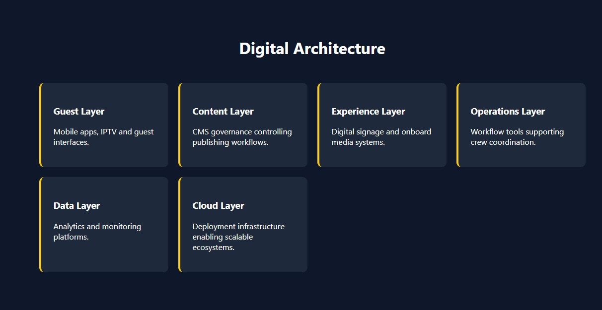

# 🚢 THE BRIDGE | Carmine D'Alise
### Systems Architect | Digital Operations Strategist | Tech Lead

<p align="center">
  
</p>

**THE BRIDGE** is a high-performance interactive ecosystem representing the nexus between 20+ years of expertise in maritime technical logistics and modern enterprise software architecture. It is not just a portfolio, but a **Digital Command Center** designed to showcase how hardware, software, and human operations converge.

---

## 🌟 The Vision: Beyond the Code
Born from a lifelong passion for technology, digital systems, and high-fidelity audio/video, my journey has taken me around the world. Serving as a **Chief AV Technician, Digital Specialist, and Digital Lead**, I have managed complex infrastructures both on-board luxury cruise ships and across global projects.

I don’t just write code; I strive to understand the **"Behind the Scenes"** of an idea. My approach is rooted in:
* **Project Decoding:** Understanding the true intent and core logic behind a business need.
* **Architectural Solving:** Designing systems that are not just functional, but scalable and resilient.
* **Problem-Solving Mindset:** A focus on finding the most efficient resolution for any technical challenge.
* **Holistic Strategy:** Bridging the gap between technical execution and marketing clarity.

---

## 🚀 The Ecosystem Hub
"The Bridge" serves as a central hub connecting flagship enterprise solutions and technical operations:

* **[Smart Ship Menu (QR)](https://smart-menu-qr.vercel.app):** High-end hospitality digital transformation with admin access.
* **[Mini Jira Demo (Docker)](https://mini-jira-demo.vercel.app):** Backend-focused ticketing system containerized with Docker and Python.
* **[HR & Training CMS Quiz](https://iacreatorcar.github.io/cms-quiz/):** Corporate assessment platform for staff skills development.
* **[Cruise CMS (Emergent)](https://sea-services.emergent.host):** Enterprise-grade content management for maritime hospitality.
* **[HotelFlow Manager](https://hotelflow-manager.vercel.app/):** Streamlined operations and guest management ecosystem.
* **[PetStyle E-commerce](https://iacreatorcar.github.io/PetStyle/):** Full front-end luxury retail experience.
* **[Technical Writing (Medium)](https://medium.com/@carmine.dalise/502-server-error-causes-and-solutions-for-businesses-a0417ce08705):** Expert analysis on server architecture and troubleshooting.

---

## 🛠️ Architecture & Tech Stack
Designed with a **Senior UI/UX** approach focused on technical precision and enterprise-level readability:

* **Core Framework:** [Astro](https://astro.build/) (Leveraging SSG for sub-1s load times and optimal SEO).
* **Stack:** React, Python (app.py), Docker, and Modern CSS3.
* **Intelligence:** Integrated behavioral analytics via **Microsoft Clarity** to optimize user journeys.
* **Governance:** Implementation of Standard Operating Procedures (SOP) and Digital Signage Quality Audits.
* **Localization:** Full bilingual support (English/Italian) for global operations.

---

## 📂 Project Structure
```text
/
├── assets/images          # High-fidelity documentation screenshots and media
├── public/                # Professional documentation, S.O.P.s and CV
├── src/
│   ├── pages/
│   │   └── index.astro    # Core Logic, Mission & Global Dashboard UI
└── package.json           # Environment configuration & build scripts