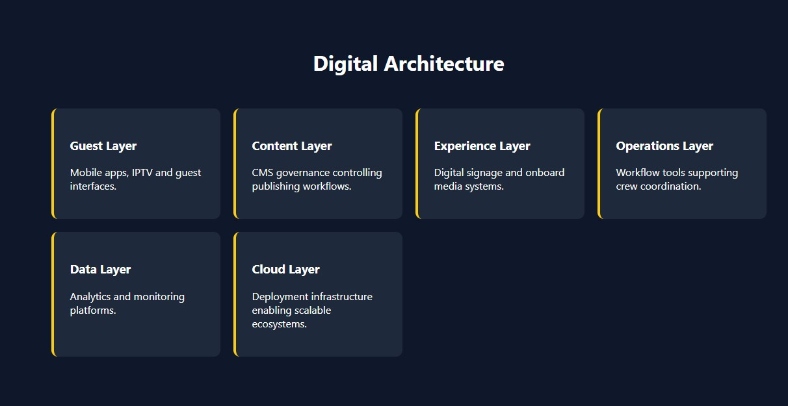

# 🚢 THE BRIDGE | Carmine D'Alise
### Systems Architect | Digital Operations Strategist | Tech Lead

**THE BRIDGE** is an interactive digital ecosystem representing the convergence between **maritime technical leadership** and **modern enterprise software architecture**.

The platform acts as a **Digital Command Center** connecting multiple systems, projects and digital environments built across years of technical operations and platform development.

It demonstrates how **software architecture, digital governance, guest platforms and onboard systems integrate into a unified ecosystem.**

---

# 🌐 Live Platform

**The Bridge (Main Platform)**

https://the-bridge-portfolio.vercel.app

---

# 🚀 Project Ecosystem

The Bridge connects multiple operational systems and experimental platforms.

### Core Systems

**HotelFlow Manager**  
Hospitality workflow platform for operational coordination.

https://hotelflow-manager.vercel.app

---

**Mini Jira (Docker Demo)**  
Operational ticketing system built with backend logic and containerized deployment.

https://mini-jira-demo.vercel.app

---

**CMS Governance Simulator**  
Interactive training environment demonstrating structured publishing workflows.

https://iacreatorcar.github.io/cms-quiz/

---

**Symphony Spa Experience**  
Cruise hospitality concept focused on spa discovery and booking experience.

https://symphony-spa.vercel.app

---

**Nexus XPanel**

Onboard digital control system prototype managing:

- IPTV
- music systems
- navigation display
- automation panels

https://nexus-xpanel.vercel.app

---

**Sea Services Platform**

Internal cruise service platform connecting:

- guest requests
- onboard operations
- crew workflows

https://sea-services.emergent.host

---

# 🗺 Destination Media Layer

The platform also integrates **destination media projects** connected to Mediterranean cruise ports.

Featured locations include:

- Barcelona
- Palma de Mallorca
- Rome
- Split
- Dubrovnik
- Athens / Piraeus
- Tarragona

The Bridge includes an **interactive Mediterranean map** displaying these locations with associated video documentation.

---

# 🧠 Architecture Philosophy

The Bridge is designed with a **systems architecture mindset**, integrating several digital layers.

### Guest Layer
Mobile applications and IPTV guest interfaces.

### Content Layer
CMS governance controlling publishing workflows.

### Experience Layer
Digital signage and onboard media systems.

### Operations Layer
Crew tools and operational workflow platforms.

### Data Layer
Analytics, monitoring and reporting systems.

### Cloud Layer
Deployment infrastructure and scalable cloud services.

---

# 🛠 Technology Stack

The platform uses a lightweight architecture optimized for performance and scalability.

**Framework**

Astro

https://astro.build

**Frontend**

- Astro components
- Modern CSS3
- responsive layouts

**Backend Concepts**

- Python microservices
- containerized environments
- workflow systems

**Mapping**

Leaflet.js interactive mapping

**Deployment**

Vercel cloud platform

---

# 📊 Analytics Integration

User behavior analytics are integrated using **Microsoft Clarity**.

Clarity enables:

- session recordings
- interaction heatmaps
- UX analysis
- usability optimization

### Clarity Project ID

📂 Project Structure
/
├── public
│   └── assets
│       └── images
│
├── src
│   └── pages
│       └── index.astro
│
├── package.json
└── README.md
👤 Author

Carmine D'Alise

Systems Architect
Digital Operations Strategist
Technology Lead

⚖️ License & Usage

This project is released for personal portfolio and demonstration purposes only.

The software, design, architecture concepts and media content are protected by copyright.

Unauthorized commercial reuse, redistribution or replication of the project structure is not permitted without explicit permission from the author.

© Carmine D'Alise — All Rights Reserved

⚓ The Bridge Philosophy

Technology is not only about code.

It is about systems thinking, operational awareness and architectural vision.

The Bridge represents the intersection of:

maritime technical leadership

enterprise digital architecture

hospitality technology systems

operational platform design